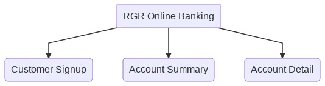
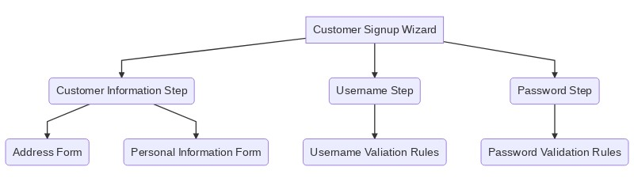

## Summary

When it comes to state management in Angular apps, there are plenty libraries to choose from. A few examples are [NGRX](https://ngrx.io/),
[Akita](https://datorama.github.io/akita/), and [NGXS](https://datorama.github.io/akita/).
You can even use libraries more popular in the React ecosystem like [Redux](https://redux.js.org/) and [Mobx](https://mobx.js.org/README.html). The point of this article is that while all of these projects are solid, they may not always be necessary and may not fit into your team or project. I believe that by understanding the basic features and concepts provided by Angular and sprinkling in a few conventions, you can achieve a simple and effective state management solution without the mental overhead or boilerplate of a 3rd party library.

The main ideas in this post:

1. **Composition** - Think about "apps of apps" when designing your Angular applications. Components should only control the state necessary for their function. Use "smart" and "dumb" components when it makes sense.

2. **Unidirectional Dataflow and Immutability** - Angular was designed to enforce unidirectional dataflow. Use services to avoid "prop drilling" through multiple components. Use OnPush change detection to have more control over change detection and increase performance. This necessitates immutable @Input properties.

3. **Unit Testing** - Use [Spectator](https://github.com/ngneat/spectator) and avoid testing implementation details of components.

Let's dive into each of these points in more detail:

## Composition

- Keep components simple
- Keep the smart / dumb pattern in mind, but don't be dogmatic
- When it makes sense, separate components into smart ones that create and change state, and dumb components that simply display data
- Favor composition over inheritance (https://en.wikipedia.org/wiki/Composition_over_inheritance). If you find yourself reaching for inheritance. Consider component composition, a directive, or a shared service first.
- Diagram showing how state is "lifted up" and shared between children. Create "Apps of apps"

In Redux and Redux-inspired state management libraries, there is a global store that is meant to hold the state of the entire application. The alternative is to use local state and component composition to achieve an "app of apps" like architecture. This means that each component should know only about it's little slice of the application. As an app grows and becomes more complex, state is "lifted up" into top level components that delegate behavior to their children.

Let's turn to an example application to help illustrate this concept. Imagine we are creating an online banking application for the Red Green Refactor Bank. Right now, our app has 3 main sections. Customer Signup, Account Summary, and Account Detail. With the magic of composition these three sections can stand alone with their own application state. Let's dive deeper into the Customer Signup section.

The Signup section is a wizard with distinct steps that guide existing customers through the process of gaining access to online banking. In this example each step has its own state with validation, forms, and whatever else is needed to accomplish the task for the user. These steps are composed and managed by the Customer Signup Wizard component, but that parent component only needs to know about the final state of the information gathered in each individual step. It doesn't need to know anything about the details of how a password is validated or how to gather a user's address.

If you've been working in Angular, React, or another component based framework, this probably all seems pretty basic to you. But it's worth touching on because having a well thought out component architecture is essential to attaining elegant state management.

- touch on smart / dumb components and composition over inheritance with simularity to object oriented classes here.

## Unidirectional Dataflow
- In my opinion, the best feature of Angular is the enforcement of unidirectional dataflow
- Pass data down via input properties and use Output bindings or services to pass data up
- Avoid using services to pass data and NEVER modify an input property by reference! (More on that later)

## Immutability
- JavaScript (and TypeScript) does not enforce Immutability no matter how much I wish it did.
- There are libraries that can achieve this for you, but in my opinion, the overhead is not worth it
- You can also add linting rules to your project, but this also isn't worth it in my opinion.
- It's not great, but the best thing to do is to probably have conversations in PRs.

## Unit Testing
- Use Spectator
- Unit test high up in the component chain
- Your tests will be more **behavior** oriented instead of testing the implementation details of lower level components.

## Conclusion
